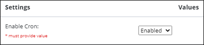
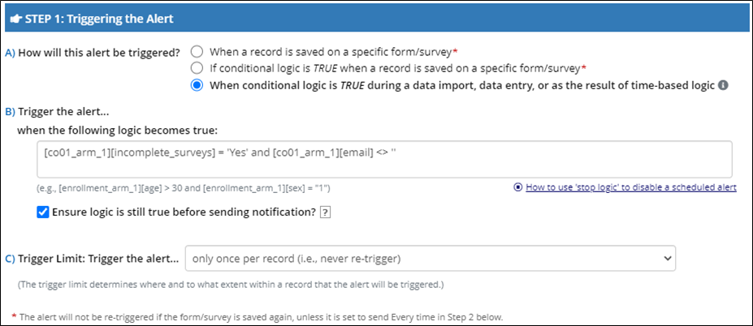
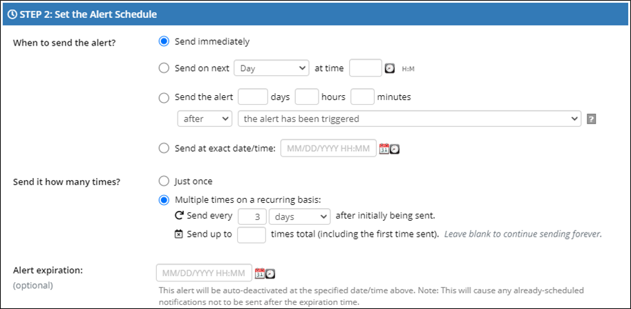
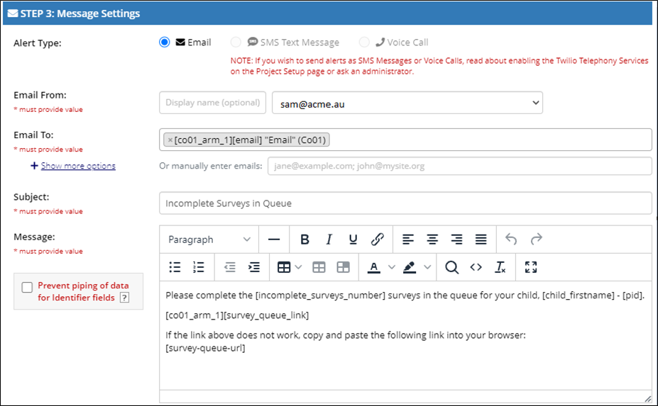

### REDCap External Module:  Survey Queue Status

*Last Modified: 2022-06-30*

The Survey Queue Status module will evaluate the project's survey queue against all records in the project.  Module output will consist of the following for each project record:

1. A value (**Yes** or **No**) that indicates whether or not incomplete surveys currently exist in the survey queue. 
1. A count of the incomplete surveys currently in the survey queue.
1. A count of the total surveys currently in the survey queue.
1. Each record's survey queue link.
1. A timestamp noting the last time the record was processed.

Additional info/features:

- The module utilizes a cron job that runs hourly.
   - A 24 hour max run time is allocated, in case the cron takes longer than an hour to run.
- Individual records are processed only once every 24 hours.
   - This can be overridden when run on-demand.
- Records are processed in batches of 100, so in the event of a module crash, it will pick up where it left off during the next run. 
- An optional component allows admins to configure the sending of automatic reminder email messages.
   - Supports rich text and piping.
- A project link, "Survey Queue Status", is included to allow for on-demand runs of the job.
   - Contains the option to ignore the 24 hour cutoff, to force all records to be checked and processed. 

---

## Setup

#### Debugging Mode

A quick note about debugging before you get started.  The `Debug Mode` option in the module config is **not** considered during automation.  It only matters when running the job manually from the project link.

#### Required Fields

The module requires admins to create the following fields in an appropriate project instrument:

> **IMPORTANT:** If the module is longitudinal, these fields **must** exist on the first event! 

- `[last_processed_datetime]`
   - Field Type: `text`
   - Validation: `Datetime w/ seconds (M-D-Y H:M:S)`
   - A Date/Time field used to track when a record was last processed.
- `[incomplete_surveys]`
   - Field Type: `text`
   - The module will write **Yes** to this field if incomplete surveys exist in the queue for the record and **No** if there are no incomplete surveys for the record.
- `[incomplete_surveys_number]`
   - Field Type: `text`
   - The module writes the number of incomplete surveys in the queue for the record.
- `[total_surveys_number]`
   - Field Type: `text`
   - The module writes the number of total surveys in the queue for the record.
- `[survey_queue_link]`
   - Field Type: `text`
   - The module writes the record's survey queue link encoded as HTML, in this format:
   - `<a href="https://redcap.myinstitution.org/surveys/?sq=Wvw4Hbf3MT">Survey Queue Link</a>`
- `[email]`
    - Field Type: `text`
    - Validation: `Email`
    - The designated field for emailing participants. 
      - Required if you intend to use the module's built-in emailing feature.

---

#### Module Configuration

After adding those fields to the project, you may enable and configure the Survey Queue Status external module.  

1. To activate the module, you must enable the cron job in the module configuration settings as shown below.  Once enabled, the module will evaluate the survey queue and update the values in the survey data fields upon the next scheduled run of the cron job.

   

1. Enable the **Survey Email** function if you will be using the built-in reminder email function.  You must specify a value for this field. (The default value is “Disabled.”)  Keep this function disabled if, for example, you wish to configure reminder emails via the REDCap Alerts & Notifications feature or if you do not want to send reminder email messages at all.

   
   
1. If you enable the **Survey Email** function, the following configurations are required:
   - **Email From**
      - Defaults to the REDCap Administrator email
   - **Email Subject**
      - Defaults to "You have surveys to complete"
   - **Email Body**
      - The text of the reminder email message you wish to send to survey respondents. You may use the rich text editor features as desired.  
      - Supports standard piping and smart variables. Example:
         - `[participant_firstname]`, below is your survey queue, which lists the `[incomplete_surveys_number]` surveys that you have not yet completed. Please click on the link below to open your survey queue; select a survey and click the **Begin Survey** button.  
         `[survey_queue_link]`  
         If the link above does not work, copy and paste this URL into your browser: `[survey-queue-url]`

1. In the **Reminder Emails Frequency (Days)** field, specify a number which represents the frequency (in days) at which you wish to send the reminder emails to survey respondents.  This value is required.
1. The **Email Initialization Date** works in conjunction with the **Reminder Emails Frequency (Days)** value to set the date on which the first reminder email messages will go out to survey respondents.  This is a required value.  Here are several examples that illustrate the **Email Initialization Date.**
   - Reminder emails will be sent weekly (every seven days), starting on April 30, 2022:
      - `Reminder Emails Frequency (Days) = 7` 
      - `Email Initialization Date = 04/23/2022`
   - Reminder emails will be sent every two weeks, starting on January 17, 2022:
      - `Reminder Emails Frequency (Days) = 14`
      - `Email Initialization Date = 01/03/2022`
   - Reminder emails will be sent every three days, starting on December 6, 2021:
      - `Reminder Emails Frequency (Days) = 3`
      - `Email Initialization Date = 12/03/2021`
1. If you wish to terminate the sending of reminder messages to survey respondents on a specified date, enter that date in the **Email End Date** field.

---

## Using the Survey Queue Status module with the REDCap Alerts and Notifications feature

If you prefer to send notifications to survey respondents using the REDCap Alerts and Notifications feature, first make sure that you disable the **Survey Email** function in the Survey Queue Status module.

Then you may write an alert with conditional logic based on the values entered into the `[incomplete_surveys]`, `[incomplete_surveys_number]`, `[total_surveys_number]`, `[survey_queue_link]` fields, in combination with other project fields.  The following page shows an example of an alert that uses a Survey Queue Status field in its logic.

