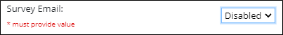

### REDCap External Module:  Survey Queue Status

*Last Modified: 12/17/2021*

At a configurable interval, the Survey Queue Status module will evaluate the project's survey queue against all records in the project.  Module output will consist of the following:

1. For each project record, a value (**Yes** or **No**) that indicates whether or not incomplete surveys currently exist in the survey queue. 
1. For each project record, a count of the incomplete surveys currently in the survey queue.
1. For each project record, a count of the total surveys currently in the survey queue.
1. Each record's survey queue link.

In addition, an optional component allows admins to configure the sending of automatic reminder email messages. 

---

## Setup

The Survey Queue Status Module uses a REDCap cron job to check the survey queue and write values to the fields listed below.  When enabled, the cron job will run each day at a time defined in the module's config file.

- The default time setting is **7:00 AM**

The Survey Queue Status Module requires admins to create the following four fields in an appropriate project instrument:

- `[incomplete_surveys]` - Text Box; the Survey Queue Status Module will write **Yes** to this field if incomplete surveys exist in the queue for the record and **No** if there are no incomplete surveys for the record.
- `[incomplete_surveys_number]` - Text Box; the module writes the number of incomplete surveys in the queue for the record.
- `[total_surveys_number]` - Text Box; the module writes the number of total surveys in the queue for the record.
- `[survey_queue_link]` - Text Box; the module writes the record's survey queue link encoded as HTML, in this format:
   - `<a href="https://redcap.myinstitution.org/surveys/?sq=Wvw4Hbf3MT">Survey Queue Link</a>`

After adding those fields to the project, you may enable and configure the Survey Queue Status external module.  

1. To activate the module, you must enable the cron job in the module configuration settings as shown below.  Once enabled, the module will evaluate the survey queue and update the values in the survey data fields upon the next scheduled run of the cron job.

   

1. Enable the **Survey Email** function if you will be using the built-in reminder email function.  You must specify a value for this field. (The default value is “Disabled.”)  Keep this function disabled if, for example, you wish to configure reminder emails via the REDCap Alerts & Notifications feature or if you do not want to send reminder email messages at all.

   
   
1. If you enable the **Survey Email** function, you must also enter an **Email body**; i.e., the text of the reminder email message you wish to send to survey respondents. You may use the rich text editor features as desired.  Also, piping is allowed in the **Email body** field; for example:
   - `[participant_firstname]`, below is your survey queue, which lists the `[incomplete_surveys_number]` surveys that you have not yet completed. Please click on the link below to open your survey queue; select a survey and click the **Begin Survey** button.
   - `[survey_queue_link]`
      - If the link above does not work, copy and paste this URL into your browser: `[survey-queue-url]`
1. In the **Reminder Emails Frequency (Days)** field, specify a number which represents the frequency (in days) at which you wish to send the reminder emails to survey respondents.  This value is required.
1. The **Email Initialization Date** works in conjunction with the **Reminder Emails Frequency (Days)** value to set the date on which the first reminder email messages will go out to survey respondents.  This is a required value.  Here are several examples that illustrate the **Email Initialization Date.**
   - Reminder emails will be sent weekly (every seven days), starting on April 30, 2022:
      - `Reminder Emails Frequency (Days) = 7` 
      - `Email Initialization Date = 04/23/2022`
   - Reminder emails will be sent every two weeks, starting on January 17, 2022:
      - `Reminder Emails Frequency (Days) = 14`
      - `Email Initialization Date = 01/03/2022`
   - Reminder emails will be sent every three days, starting on December 6, 2021:
      - `Reminder Emails Frequency (Days) = 3`
      - `Email Initialization Date = 12/03/2021`
1. If you wish to terminate the sending of reminder messages to survey respondents on a specified date, enter that date in the **Email End Date** field.

---

## Using the Survey Queue Status module with the REDCap Alerts and Notifications feature

If you prefer to send notifications to survey respondents using the REDCap Alerts and Notifications feature, first make sure that you disable the **Survey Email** function in the Survey Queue Status module.

Then you may write an alert with conditional logic based on the values entered into the `[incomplete_surveys]`, `[incomplete_surveys_number]`, `[total_surveys_number]`, `[survey_queue_link]` fields, in combination with other project fields.  The following page shows an example of an alert that uses a Survey Queue Status field in its logic.

